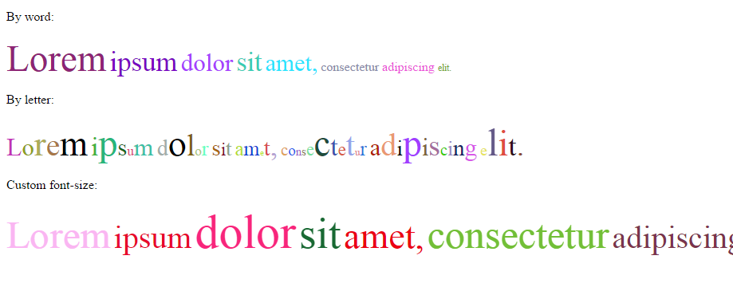

# text-colorizer.js

Script to format the text in the text with a random color and size (words or letters).

### Using
```
<script src="path/to/text-colorizer.js"></script>
<script>
(function () {
		
    var element = document.querySelector('#text-colorize-word');
    textColorizer(element, true);

}());
</script>
```

### API
```
textColorizer(domElement, [isByWord, maxFontSize, minFontSize]);
```

### Screenshot


---
&copy; 2015 Yauheni Pakala | MIT
